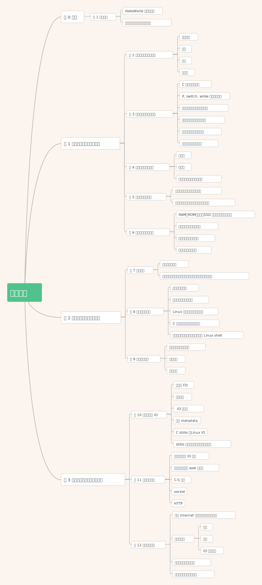

# 前言

其他系统书都是从**构建者**的角度来写的，讲述如何实现硬件或系统软件，包括操作系统、编译器和网络接口。而本书是从**程序员**（对应书名：A Programmer‘s Perspective）的角度来写的，讲述应用程序员如何能够利用系统知识来编写更好的程序。

## 背景知识

- 需要背景知识：Linux、C
- 不需要背景知识：硬件、机器语言、汇编语言

## 如何阅读此书

学习系统的唯一方法就是做系统，家庭作业的难度

- `*`  只需要几分钟
- `**` 可能需要将近 20 分钟
- `***` 需要很大的哪里，也许是 1～2 小时
- `****` 一个实验作业，需要将近 10 小时

## 本书概述

