# 计算机系统漫游

```c
#include <stdio.h>

int main()
{
    printf("hello, world\n");
    return 0;
}
```

我们通过跟踪 hello 程序的生命周期来开始对计算机系统的学习，主要（不完整）包括：

- 被程序员创建**源文件**
- 被编译器，汇编器，链接器等工具翻译成**可执行目标程序**
- 在系统上**运行**，输出简单消息
- 终止

## 信息就是位 + 上下文（源文件）

hello.c 源程序实际上是由值 0 和 1 组成的**位/比特序列**，8 个位组成一组，称为字节。hello.c 程序以字节序列的方式存储在文件中，每个字节对应一个整数值，对应某些字符。

> 像 hello.c 这样只由 ASCII 字符构成的文件称为**文本文件**，其他所有文件都称为**二进制文件**。

### 位

hello.c 的表示方法说明了一个基本思想：系统中的所有信息都由一串**位/比特**表示。包括：

- 磁盘文件
- 内存中的程序
- 内存中的用户数据
- 网络上传送的数据

### 上下文

区分不同的**数据对象/位/比特**的唯一方法就是我们读到**数据对象/位/比特**时的**上下文**。同一个字节序列，在不同的上下文中可表示不同的**信息**：

- 整数
- 浮点数
- 字符串
- 机器指令

其中，数字的机器表示方式与实际的整数/实数不同，他们是真值的有限近似，因此有时会违背我们直觉。

## 程序被其他程序翻译成不同格式（可执行目标程序）

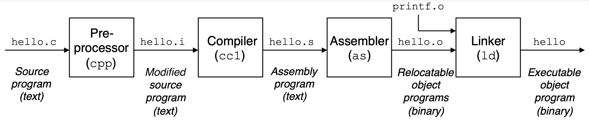

- **预处理阶段**
- **编译阶段**：将文本 hello.i 从较高级的 C 语言翻译成较低级的汇编语言，得到文本文件 hello.s。汇编语言是有用的，它为不同高级语言的不同编译器提供了通用的输出语言，例如，C 编译器和 Fortran 编译器生成的输出文件都是一样的汇编语言。
- **汇编阶段**：将文本 hello.s 翻译成机器语言指令，把这些指令打包成文件可**重定位目标程序**（obj，relocatable object program）格式，并将结果保存到 hello.o 中。hello.o 是二进制文件，包含 main 的指令编码。
- **链接阶段**：printf 函数位于一个名为 printf.o 的单独的预编译好的目标文件中，这个文件必须以某种方式合并到我们的 hello.o 程序中。链接器负责处理这种合并，结果就是得到 hello 文件，他是一个可执行目标文件，可以被加载到内存中，由系统执行。

> GNU 项目的目标是开发一个完整的类 Unix 系统，目前已经开发出了包含 Unix 操作系统的主要部件环境（除了 Linux 内核），包括：
>
> - **EMACS 编辑器**
> - **GCC 编译器**
> - GDB 调试器
> - **汇编器**
> - **链接器**
> - 处理二进制文件的工具和部件
>
> 可以看到 GNU 的部件对应了程序的上述几个阶段。
>

了解编译系统如何工作大有益处：

- **优化程序性能**
  - 为了在编写 C 程序时做出更好的选择，有必要了解：
    - 机器代码
    - 编译器将 C 语句转化成我机器代码的方法
  - 上述两点影响到程序运行的性能：
    - switch 比一系列的 if-else 高效？
    - 函数调用开销？
    - while 比 for 高效？
    - 指针引用比数组索引高效？
    - 为什么循环求和，将结果放入本地变量回比放到通过引用传递过来的参数快？
    - 为什么重排一下算数表达式括号回变快？
- **理解链接时的错误**
- **避免安全漏洞**
  - 理解堆栈远离和缓存溢出

## 处理器读并解释储存在内存中的指令（运行时）

在 shell 中运行 hello 程序：

- shell 命令行解释器加载并运行 hello 程序，等待程序结束
- hello 打印消息，然后终止
- shell 打印提示符，等待下一次输入

### 系统的硬件组成

为了理解运行 hello 程序时发生了什么，我们需要了解系统的硬件组成：

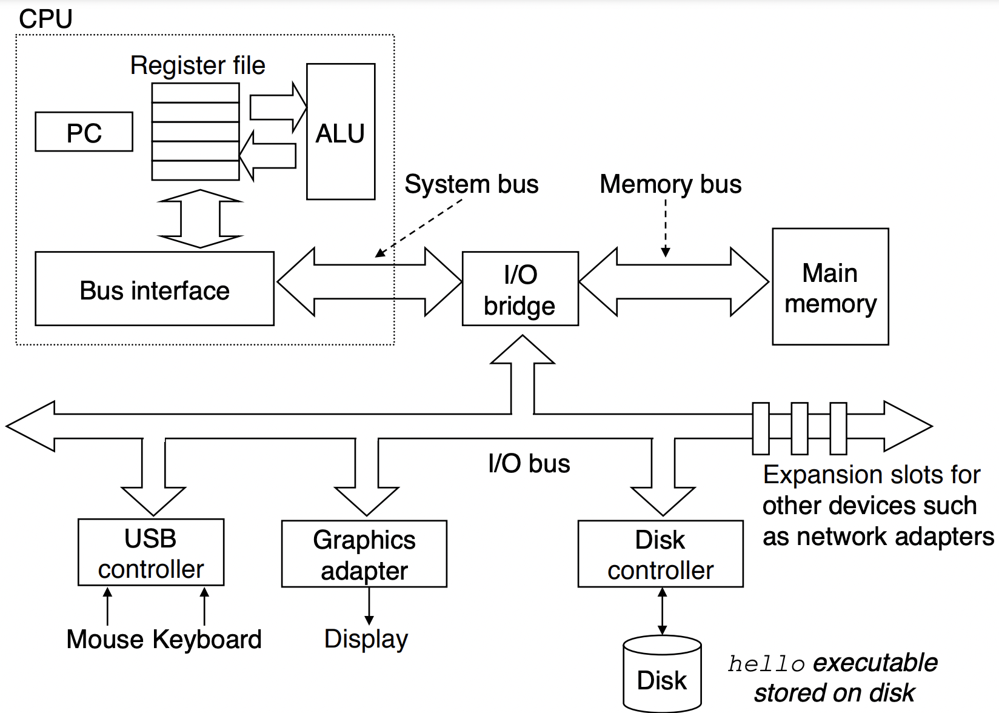

- **总线**：携带信息并负责信息在各部件之间传递。总线通常被设计成传递定长的字节块，也就是**字**（word），字中的字节数为**字长**通常为 4 或者 8，对应 32 位和 64位。
- **IO 设备**：系统于外部世界联系的通道。包括：
  - 作为用户输入的键盘/鼠标
  - 作为用户输出的显示器
  - 用作长期存储数据和程序的磁盘
- **主存储器**：临时存储设备，处理器执行程序是，存放程序和程序处理的数据。
- **处理器**：解释/执行主存储器中指令的引擎。它的核心是一个大小为一个字存储设备/**寄存器**，称为**程序计数器 PC**，PC 总是指向贮存中某条机器语言指令。处理器的指令执行模型由**指令集架构**决定。简单的指令执行模型可以看作顺序执行：
  - 从 PC 指向的内存中读指令
  - 解释指令中的位，执行指令指示的简单操作
    - 简单操作可能包括：
      - **加载**：从主存储器中复制一个字到寄存器
      - **存储**：从寄存器中复制一个字到主存储器
      - **操作**：从寄存器中复制一个字节/字到 ALU，ALU 计算后将结果存到寄存器
      - **跳转**：从指令中复制一个字到 PC
    - 处理器的指令可分为**抽象**的指令集指令和**具体**的实现：
      - **指令集架构**：描述每条机器代码指令的效果
      - **微体系结构**：处理器实际的实现，比如通过复杂的机制来加速，预测和优化机器语言程序的性能
  - 更新 PC，指向的下一指令不一定和刚刚执行的指令相邻

### 程序执行过程

hello 程序的执行过程（省略细节）如下：

- 在键盘上输入字符串 "./hello" 的时候，shell 程序将字符**逐一**读入寄存器并存放到主存储器中。

  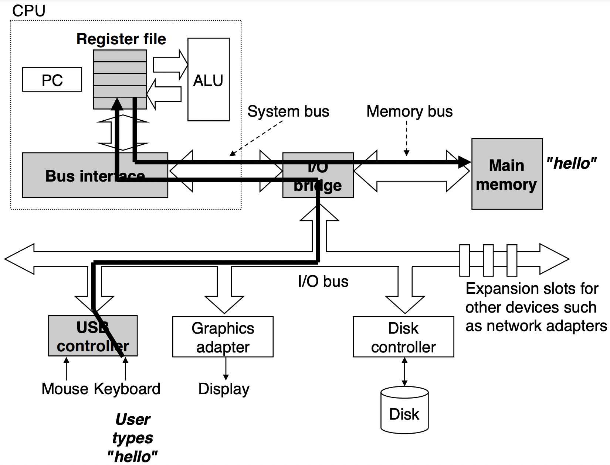

- 在键盘上敲回车，shell 程序知道输入结束，然后执行**一系列指令**来加载可执行的 hello 目标文件，这些指令将 hello 目标文件的程序代码和数据从磁盘复制到主存储器，利用 **DMA** 数据不需要通过处理器可直接从磁盘到达主存储器。

  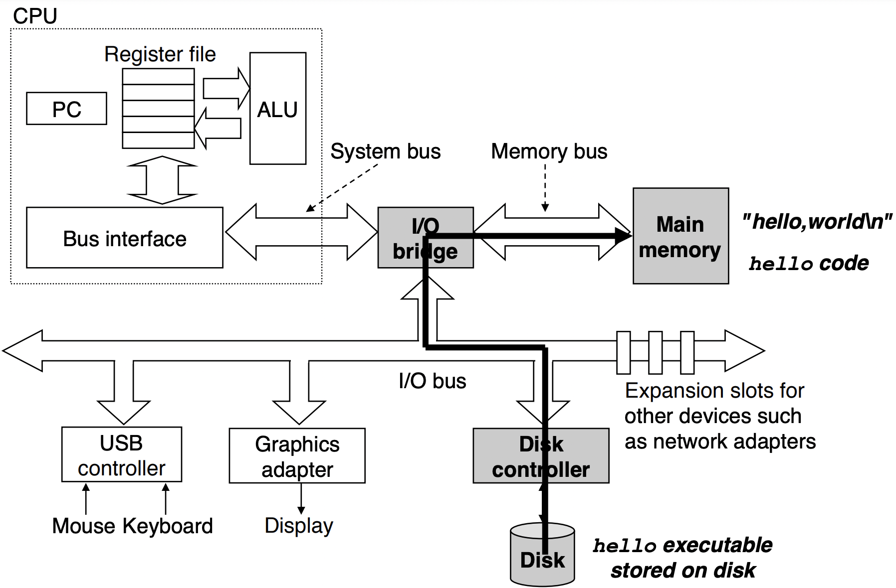

- 处理器从主存储器中读取并执行 main 程序中的机器语言指令，这些指令将 "hello, world\n" 字符串中的字节逐个复制到寄存器，在从寄存器复制到显示设备，最终显示到屏幕

  

## 高速缓存

从上面的运行过程可以看到，IO 设备（磁盘，键盘，显示设备），主存储器，处理器存在多次的指令和数据的复制。

- **从程序员的角度来看**，这些复制是开销，减慢了程序“真正”的工作。

- **从系统设计者的角度**，他们的主要目标就是让这些复制操作尽快完成。

读写速度：磁盘 << 主存 < 寄存器。

随着这些年半导体技术的进步，处理器于主存之间的差距还在持续增大，加快处理器运行速度比加快主存的运行速度更容易并且更便宜。针对处理器和主存之间的差异，系统设计者采用了**高速缓存**（cache），高速缓存一般分成三级（L1/L2/L3）。

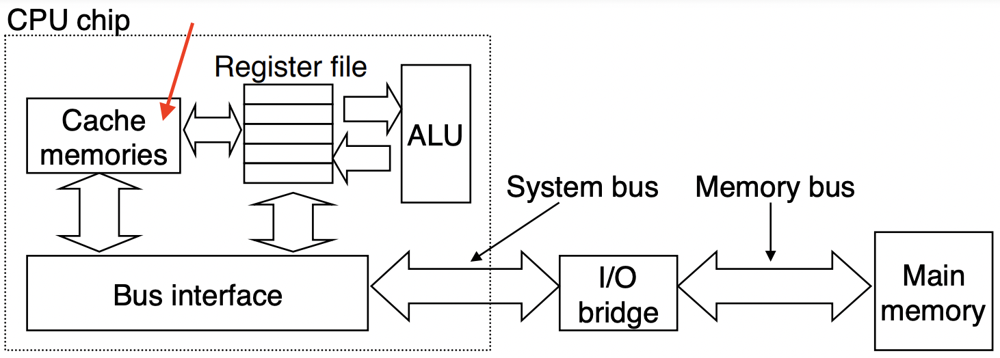

程序员能够利用高速缓存将程序的性能提高，原因是利用高速缓存的**局部性原理**，即程序具有访问局部区域里的数据和代码的趋势。

## 存储设备的层次结构

在存储设备的层次结构中，从上至下，设备的访问速度越来越慢，容量越来越大，每字节的造价也越来越便宜。

存储设备层次结构的主要思想：上一层的存储器作为下一层存储器的高速缓存，程序员可以利用对整个存储器层次结构的理解来提高程序的性能。

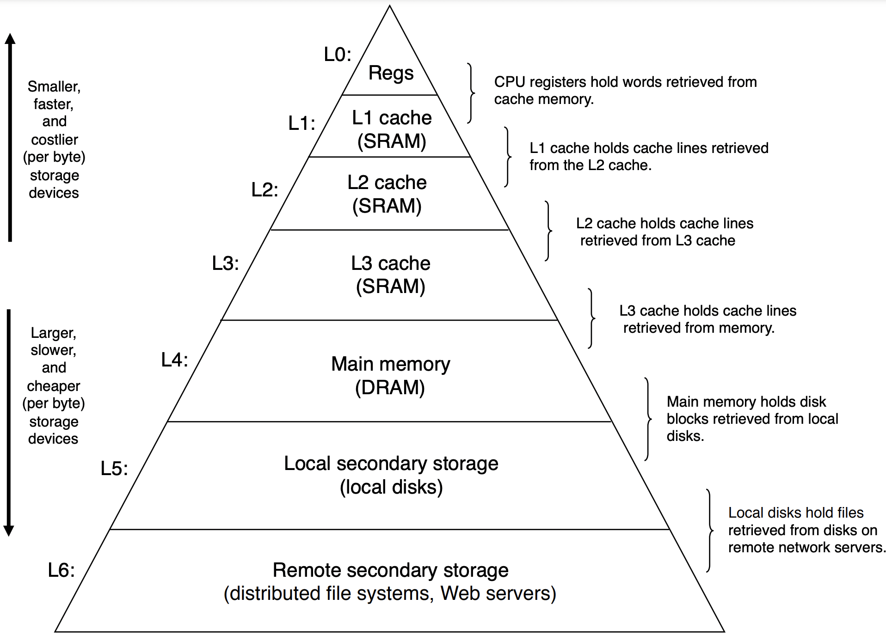

## 操作系统

shell 加载和运行 hello 程序，以及 hello 程序打印消息时，shell 和 hello 都没有直接访问键盘、显示器、磁盘和主存。应用程序对硬件的操作尝试必须通过**操作系统**，操作系统可以看成是应用程序和硬件之间插入的一层**软件**。

操作系统的两个基本功能：

- 防止硬件被失控的应用程序滥用
- 向应用程序提供简单一致的机制来控制复杂并且大不相同的低级硬件设备

这两个功能通过如下基本的抽象概念来实现：

- **文件**：IO 设备的抽象
- **虚拟内存**：主存和磁盘 IO 设备的抽象
- **进程**：处理器、主存、IO 设备的抽象

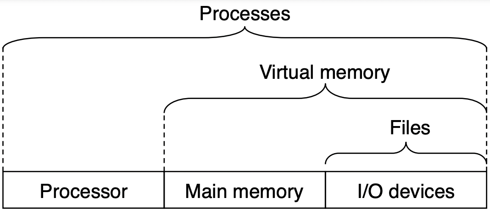

> 在 《OSTEP》 中，分为如下几个部分讲述操作系统：
>
> - 虚拟化：
>   - 进程：处理器的抽象
>   - 地址空间：内存的抽象
> - 并发：线程
> - 持久化：文件：磁盘 IO 的抽象

### 进程

hello 程序在系统上运行时，操作系统提供一种假象：系统上只有 hello 程序在运行，程序看上去独占了处理器、主存、IO 设备。这种假象通过进程的概念来实现。关于进程的几个概念：

- **进程**：操作系统对一个正在运行的程序的抽象。一个系统上可同时运行多个进程，而么每个进程好像独占硬件。

- **并发**：指一个进程的指令和另一个进程的指令交错执行。操作系统实现这种交错执行的机制称为**上下文切换**。

- **上下文**：操作系统保持跟踪进程所需要的所有状态信息。比如 PC 和寄存器的当前值，以及主存的内容。

- **上下文切换**：保存当前进程的上下文、恢复新进程的上下文，然后将控制权传递到新进程。当操作系统决定要把控制权从当前进程转移到某个新进程时，就回发生上下文切换，切换后新进程从它上次停止的地方开始。当我们让 shell 运行 hello 程序时，shell 通过调用一个专门的函数，即**系统调用**，来执行我们的请求。

- **内核**：系统管理全部进程所用代码和数据结构的集合，它不是一个独立的进程。从一个进程到另一个进程的转换就是由操作系统内核管理的。内核是操作系统代码常驻主存的部分。当应用程序需要操作系统的某些操作时，比如读写文件，它就会执行一条特殊的**系统调用**指令，将控制权传递给内核，内核执行被请求的操作并返回应用程序。

  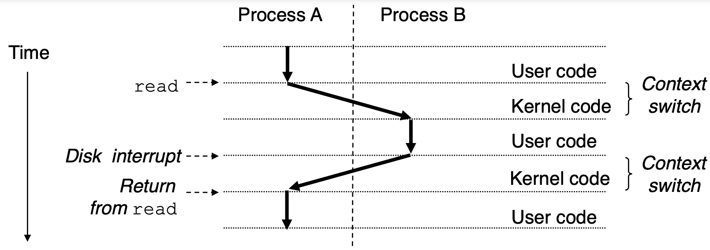

### 线程

一个进程实际上可以由多个称为**线程**的执行单元组成，每个线程运行在进程的上下文中，共享同样呢的代码和全局数据。

### 虚拟内存

虚拟内存为每个进程提供一个假象：每个进程独占主存。每个进程看到的内存都是一样的，称为**虚拟地址空间**。

Linux 的虚拟地址空间由大量准确定义的区构成：

- **代码和数据区**：对于所有进程来说，代码从同一固定地址开始，紧接着时和 C 全局变量相对应的数据位置。代码和数据区是直接按照可执行目标文件的容初始化的，在进程一开始运行时就被指定了大小。
- **堆区**：运行时堆，调用 malloc 和 free 这样的 C 标准库函数时，堆可以在运行时动态扩展和收缩。
- **共享库区**：大约在地址空间的中间部分时一块用来存放像 C 标标准库和数学库这样的共享的代码和数据区。
- **栈区**：位于用户虚拟地址空间的顶部，编译器用它来实现函数调用。用户栈在程序执行时可以动态第扩展和收缩。
- **内核虚拟内存区**：地址空间的顶部区域为内核保留的。不允许应用程序读写该区域的内容或者直接调用内核代码定义的函数。

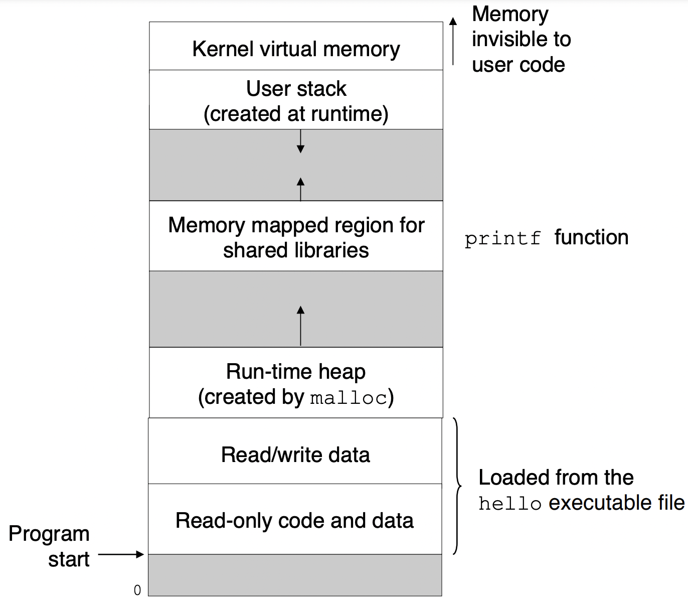

### 文件

文件就是字节序列（对应《信息就是位 + 上下文》中的位）。每个 IO 设备都可以看成文件，包括：

- 磁盘
- 键盘
- 显示器
- 网络

系统中的所有 IO 都通过使用称为 Unix IO 的系统函数调用，读写文件来实现。文件概念非常强大，它向应用程序提供了一个统一的视图，看待系统中各式各样的 IO 设备。

从程序员的角度来看，文件足够抽象，处理磁盘文件的内容无需了解具体的磁盘计数，同一个程序可以在使用不同磁盘技术的不同系统上运行。

## 系统之间利用网络进行通信

通过网络可以将多个系统连接在一起。而从单独的系统来看，网络可以视为一个 IO 设备：

- 当系统从主存复制一串字节到网络适配器时，数据流经过网络发送到另一台机器
- 系统可以读取从其他机器发送来的数据，并把数据复制到自己的主存

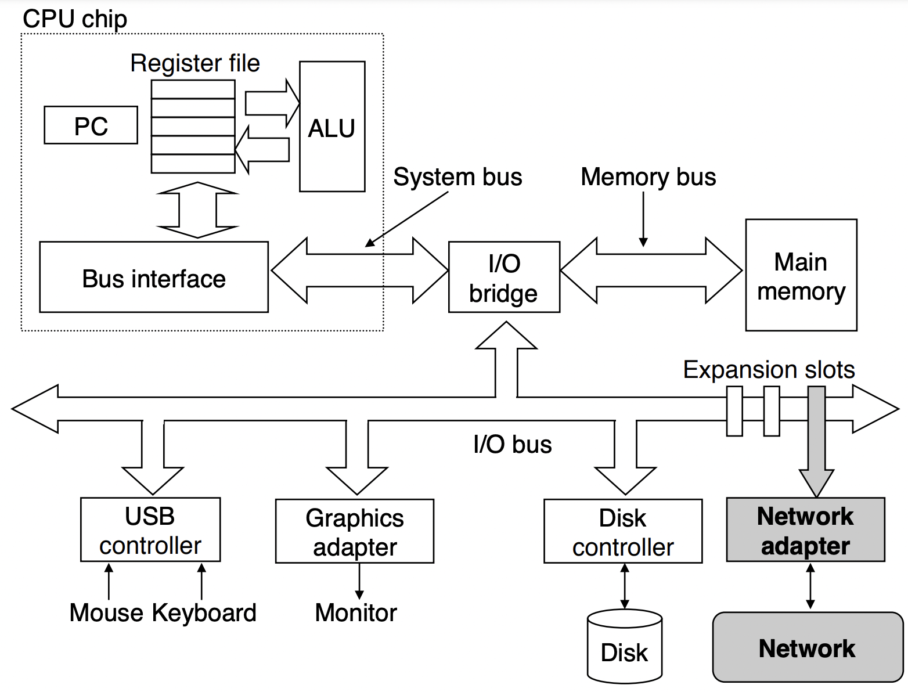

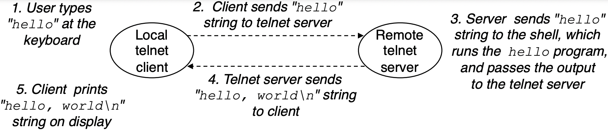

## 其他重要概念

### Amdahl 定律（阿姆达尔）

加速比公式：
$$
\begin{align}
S &= \frac{T_{old}}{T_{new}} \\
& = \frac{T_{old}}{(1-a)T_{old} + aT_{old}/k} \\
& = \frac{1}{(1-a) + a/k}
\end{align}
$$
其中，

- $ T_{old} $ ：加速前的总耗时
- $ T_{new} $ ：加速后的总耗时
- $ a $ ：加速部分占总体的比例
- $ k $ ：加速部分加速的倍率

反过来，$ k = \frac{a}{1/S - 1 + a} $

假设 $ a=0.6 $，$ k=3 $，最终得到 $ S=1.67 $，虽然我们堆系统的某一主要部分做出了重大改进，加速了 3 倍，但最终整体系统的加速比却只有 1.67，这就是 Amdahl 的主要观点：要想显著加速整个系统，必须提升全系统中相当大的部分的速度。

当 $ k\to\infty $ 时，即当我们区系统的某一部分加速到某个点使这部分时间可以忽略时，有
$$
\lim_{k\to\infty} S = \lim_{k\to\infty} \frac{1}{(1-a)+a/k} = \frac{1}{1-a}
$$
说明系统整体加速比上限受制于无法加速的部分。

> 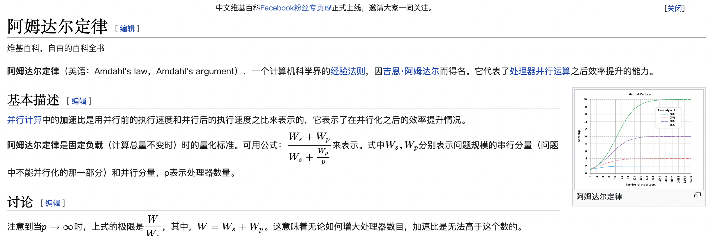

### 并发和并行

- 并发（concurrency）：是一个通用的概念，指一个同事具有多个活动的系统
- 并行（parallelism）：是指用并发来时一个系统运行的更快

并行可以在计算机系统的多个抽象层次中运行，按照系统层次结构中由高到低的顺序强调 3 个层次。

#### 线程级并发

- 进程级并发：基于进程这个抽象上，我们能够设计出同时有多个程序执行的系统
- 线程级并发：基于线程这个抽象上，我们能够在一个进程中执行多个控制流

通过系统中处理数量的不同来分类：

- 单处理器系统：在以前，即使处理器必须在多个任务间切换，大多数实际的计算也都是有一个处理器来完成。这种并发执行只是模拟出来的，通过系统的进程间快速切换来实现。

- 多处理器系统：由单操作系统内核控制的多处理器组成的系统。随着多核处理器和超线程的出现，这种系统变得常见。

  - 多核处理器：将多个 **CPU 核**集成到一个集成电路芯片上。典型的多核处理器的组织结构：

    - 4 个 CPU 核
    - 每个核拥有自己的 L1/L2 高速缓存，L1 分为数据缓存和指令缓存
    - 所有核共享 L3 和主存

    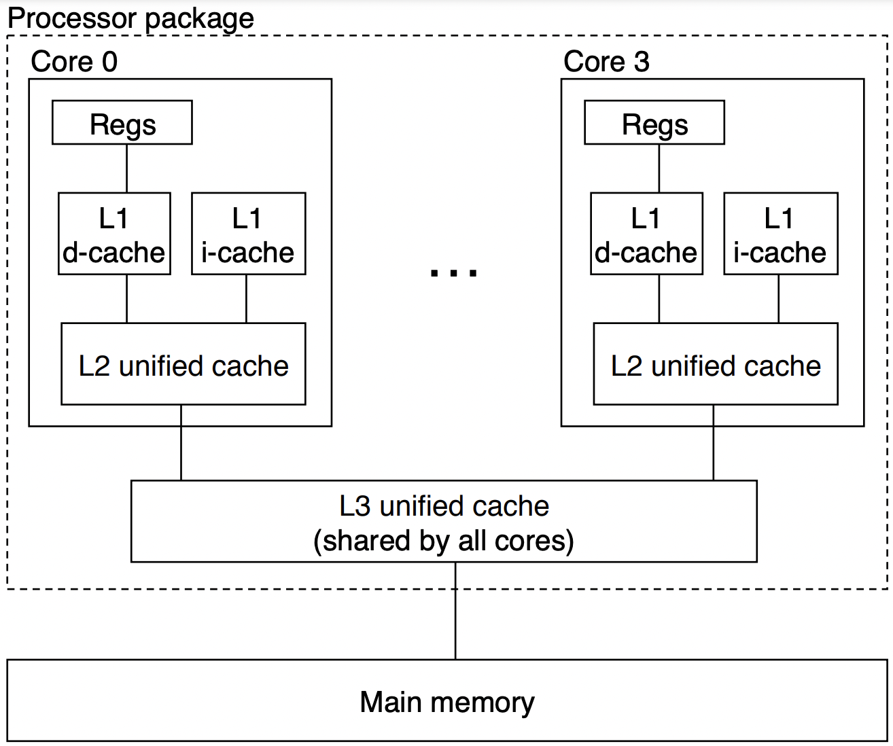

  - 超线程：又称为同时多线程，一项允许一个 CPU 核执行多个控制流的技术。

    - CPU 核某些硬件有多个备份，比如 PC 和寄存器文件
    - CPU 核其他硬件部分只有一份，比如执行浮点算数运算的单元

    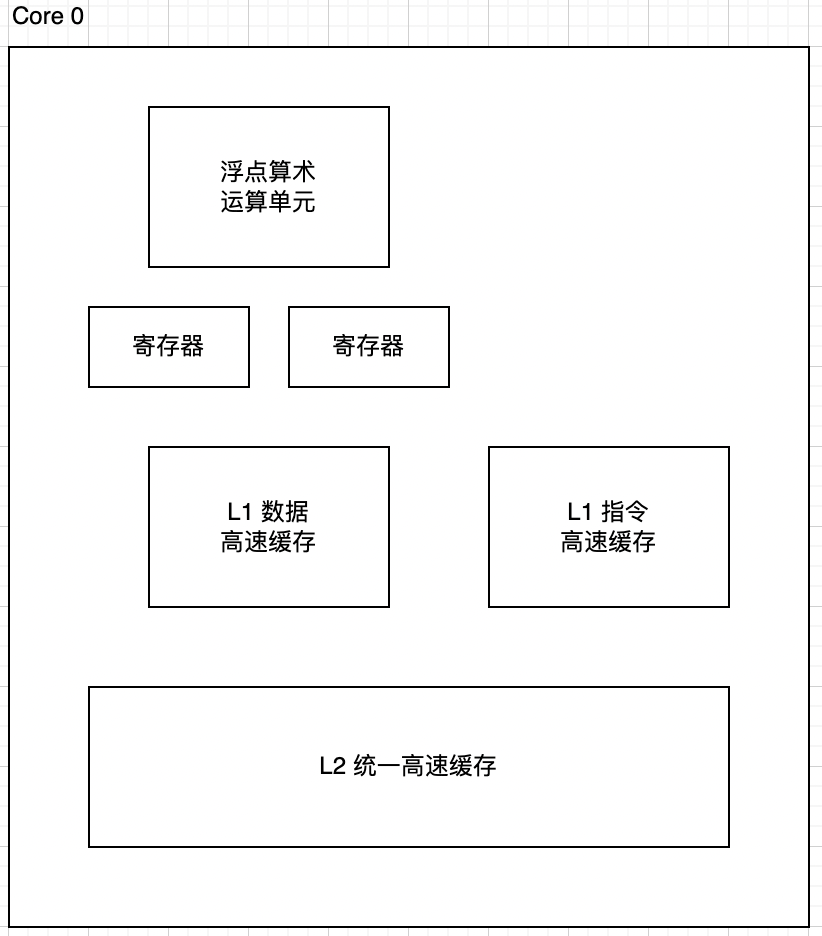

    常规的处理器需要 2000 个时钟周期做不同的线程切换，而超线程处理器可以在单个周期的基础上决定要执行哪一个线程。比如，某一线程必须等到数据被装载到高速缓存中，那 CPU 就可以继续执行另一个线程。举个例子，Intel Core i7 处理器可以让每个核执行两个线程（超线程），所以一个 4 核的系统实际上可以并行地执行 8 个线程。

  多处理器的使用可以从 2 方面提高系统性能：

  - 减少执行多任务时模拟并发的需要，模拟并发时的上下文切换有开销
  - 如果应用程序以多线程的方式来编写，那么应用程序可以运行得更快

#### 指令级并行

指令级并行：现代处理器可以同时执行多条指令的属性。现代处理器可以保持每个时钟周期 2～4 条指令的速率执行，其实每条指令从开始到结束需要长很多的时间，大约 20 个或者更多周期，但是处理器使用了很多技巧同时处理多达 100 条指令。

**流水线**作业中，把执行一条指令所需要的活动划分成不同的步骤，处理器的硬件组织称一系列的阶段，每个阶段执行其中的一个步骤。而各个阶段之间互不影响，可以并行地操作，处理不同指令的不同部分。

超标量处理器：处理器可以达到比一个周期一条指令更快的执行速率。

#### 单指令、多数据并行

单指令、多数据并行，又称为 **SIMD** 并行：在最低层次上，现代处理器拥有特殊的硬件，允许一条指令产生多个可以并行执行的操作。例如，并行地堆 8 对单精度浮点数做加法的指令。

SIMD 指令一般为了提高影像、声音、视频数据应用的执行速度，有些编译器回事图从 C 程序中自动抽取 SIMD 并行性，但更可靠的方法是用编译器支持的特殊的向量数据来写程序。

### 抽象的重要性

抽象可以使得程序员无须了解内部的工作便可以使用。比如，在处理器中，指令集架构提供了对实际处理器硬件的抽象。使用这个抽象，机器代码程序表现得像运行在一个一次执行一条指令的处理器上，而实际的底层硬件远比抽象描述得要复杂精细，它并行地执行多条指令，但又总是与那个简单有序的抽象模型保持一致。

除了进程，虚拟内存，文件之外，还有更高级别的抽象：虚拟机，虚拟机可用于抽象操作系统。

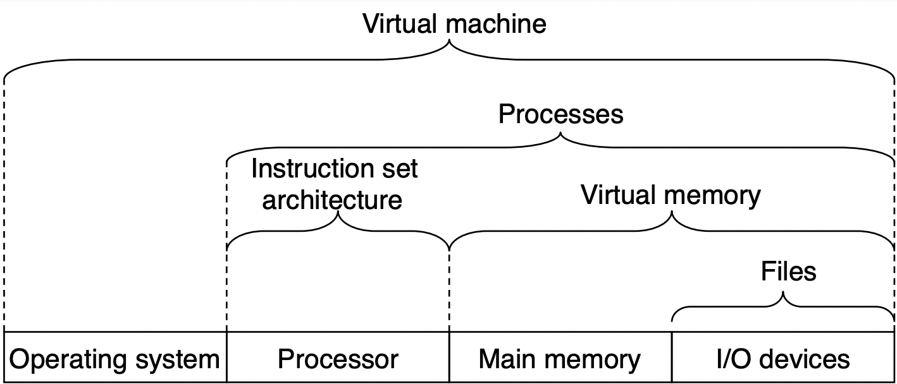


